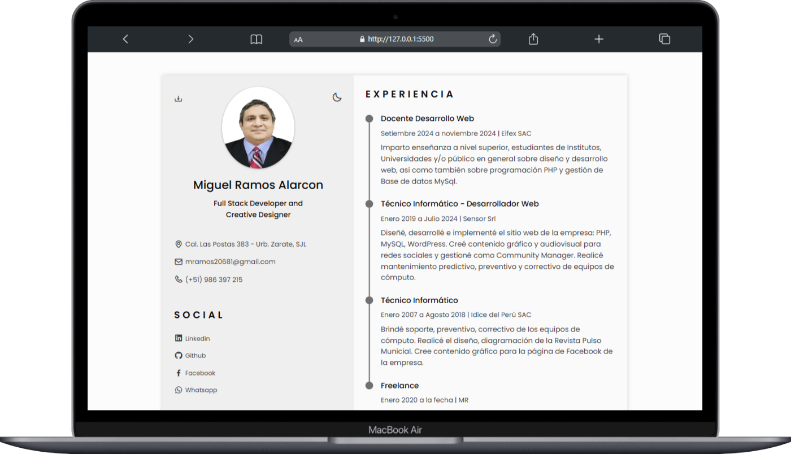
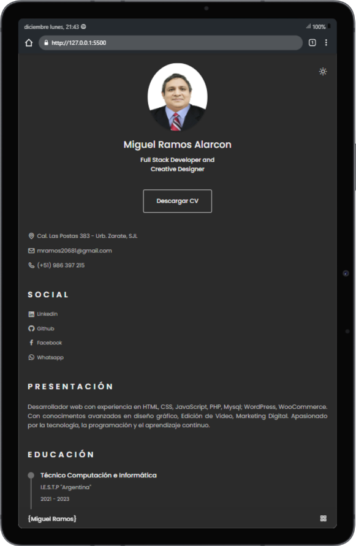
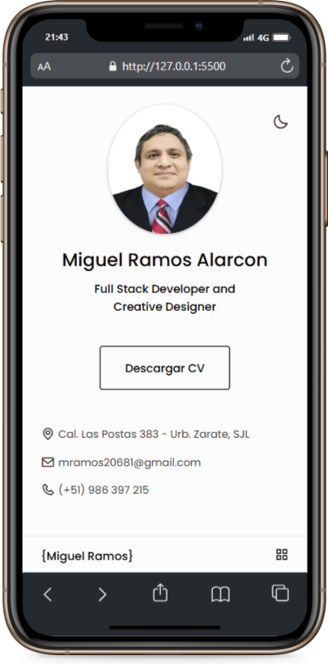

# CV Miguel Ramos Alarcon - Online

  
  

## Requirements
- [x] Fully styled and responsive website
- [x] Consistent color scheme and typography
- [x] Use flexbox, media queries, and grid to create a responsive layout

### Bonus:

- [x] Utilize Google Fonts
- [x] Link to GitHub pages
- [x] Add dark mode support

### Capturas de pantalla

Diseño adaptado para cualquier tipo de pantalla del dispositivo:

    
🖥️ Desktop version

    
📱 Tablet version

    
📱 Mobile version

### El proyecto se encuentra alojado en mi repositorio de GitHub:

- [Codigo fuente]()
- [CV Online](https://miguelramosalarcon.github.io/CV-Miguel-Ramos-Alarcon/)
- [Boxi Icons](https://boxicons.com/)

> [!IMPORTANT]
> **“En medio de la dificultad reside la oportunidad."** No dejemos de practicar, esforcémonos por lo que nos apasiona.
